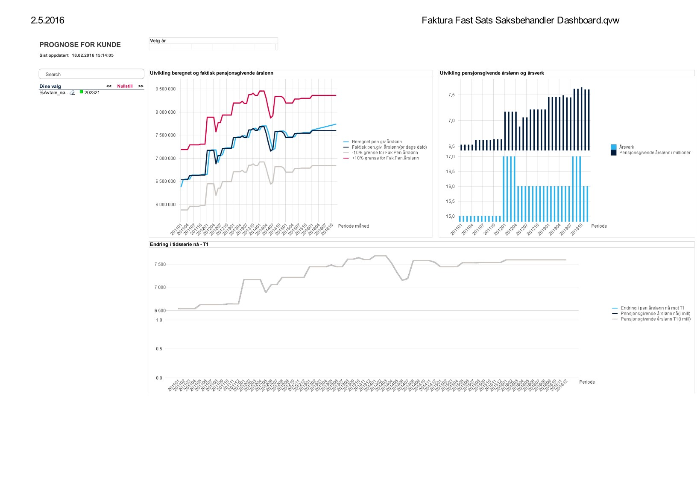
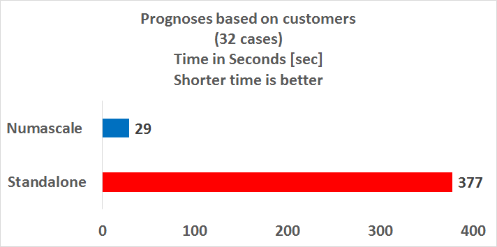
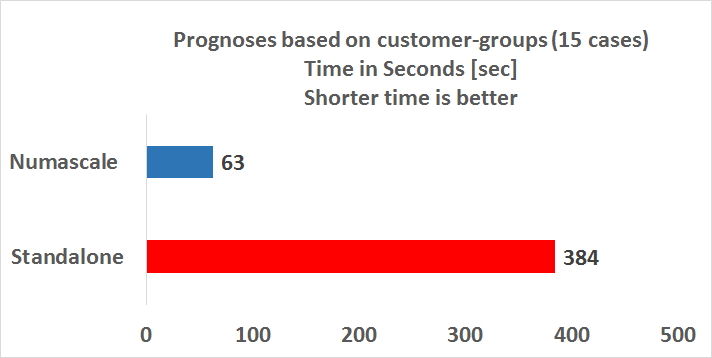
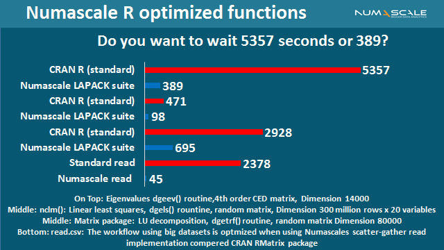
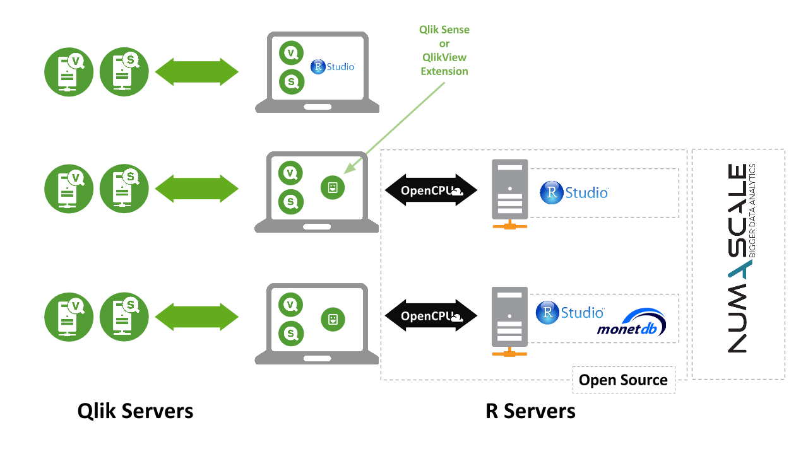
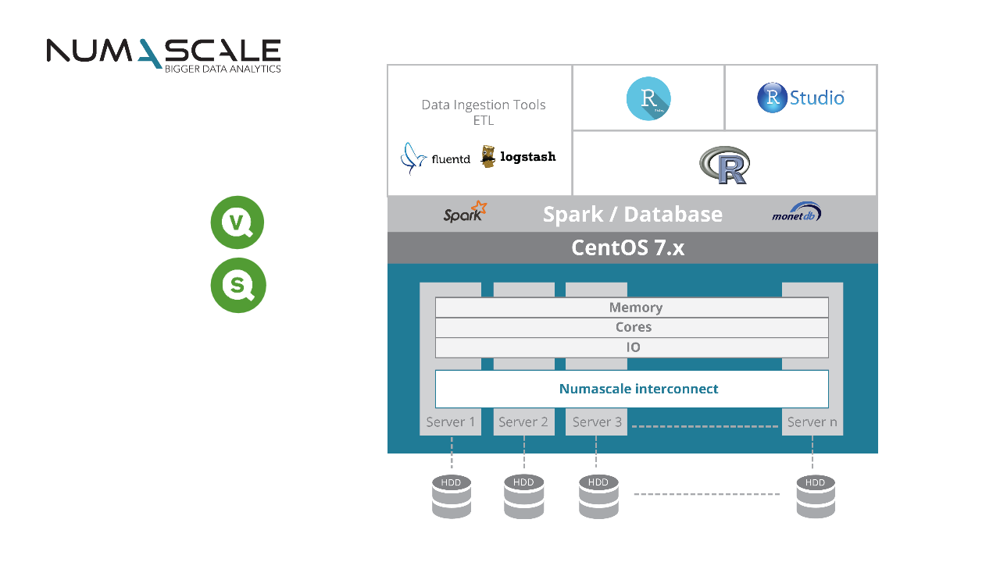

```{r,echo=FALSE,message=FALSE,warning=FALSE}
library(QlikQonnections2016)
library(dplyr)
library(knitr)
library(sqldf)
library(MARSS)
library(ggplot2)
library(foreach)
library(doParallel)
```


---

# Personal info:

* Cand.oecon. (Master in Economics, University of Oslo (UiO)) and Ph.D. Economics (Norwegian School of Economics (NHH))
* Postdoctoral researcher (BI Norwegian Business School)
* Since 2015 Employed as Senior Advisor and Data Scientist at the Norwegian Government Public Pension Fund (SPK)

---

# The Norwegian Government Public Pension Fund (SPK)


* Founded in 1917 
* Provides pensions and other insurance products forpublic service employees and other quasi-goernment organizations
* In 2016 about 300.000 members (10 percent of the workforce) employed by 1200 organsisations/customers
* The customers can be divided into 12 customer-groups (e.g., Schools, Colleges, Universities, Departments)
* I will focus mainly on agregate data at the customer-group level in this presentation

---

* The products offered:
    * Disability pension
    * Mortgage loan
    * Early retirement pension
    * **Retirement pension (this will be the focus in this presentation)**

---

# The Premium Process for Retirement Pension at SPK

* Each customer pays a premium (covering both employers and employees):
<center>$\text{YearlyPremium=PensionWageIncome*PremiumRate}$</center>
* The premium is payed six times a year:
<center>$\text{PeriodPremium=YearlyPremium/6}$</center>
* In 2016 premium income was 1.2 billlion Norwegian kroners (equal to about 146 million dollars)
* The $\text{PremiumRate}$ is based on a complex formula (not covered here)
* While the $\text{PensionWageIncome}$ is since 2015 based on a forecast model at the start of each year.

---

* The model is estimated in R-Studio (MARSS-package) 

* The forecast and the actual development are during the year monitored in a QlikView-Dashboard

* If predictions go wrong (i.e., +/- 10 percent outside forecast), reestimaton procedure is implemented
* A clearing procedure takes place at the start of next year



---

# Three strategies for implementing Qlik and R for the Premium Process:

* Strategi I : The non-integrated R and Qlik approach (current) 
* Strategi II: The integrated R and Qlik approach (desktop and server)
* Strategi III: The streamlined and integrated R and Qlik approach (server)

---

## Strategi I: The non-integrated R and Qlik approach approach


```{r, eval=FALSE, echo=FALSE, warning=FALSE}
# This script provides the datainput to Qlik for application #1
startp <- c(2007,1)
sluttp <- c(2016,2)
sluttpro <- c(2016,12)
#modelltype <- c(1)
variabler <- c(1,2)[1]
modelltype <- c(1,2)[1:2]  #[1:2]
customers <- seq(1,15)[1:15] #[1:15]

tidseriedatadf <- sqldf::read.csv.sql("data/PGlonnaggps.rda",sql = "SELECT * FROM PGlonnaggps") %>% dplyr::filter(avtalenr%in%customers)  %>% dplyr::select(observasjonsdato,avtalenr,aar,maaned,premiestatus,nobs,pensjonslonn,antallStillinger)

tidseriedata <- as.list(tidseriedatadf)
custforecast <- prognoseestimeringb(startp,sluttp,sluttpro,tidseriedata,modelltype,variabler)

colnames(custforecast) <- rep(c("customer","year","month","wagelevel (pension)","wageforcasting","wageforcastingvariance","model"),length(modelltype))

#Storing results
## from estimation
devtools::use_data(custforecast,overwrite = TRUE)
write.csv(custforecast, file = "data/custforecast.csv")
```
---

### Qlik Sense application 1


<center>Demo I will be shown here</center>

---

### Main comments:

* Fast viewing
* A more experimental approach could easily imply memory problems (Curse of dimensionality)
    * Assume we want to add two extra models and an additional variable to the setup:
    
$$\text{Combinations before}= 1*1*1200 = 1200 $$ 
$$\text{Combinations now} = 3*2*1200 = 7200  $$ 
     
---

## Strategi II: The integrated R and Qlik approach (desktop) 


```{r, eval=FALSE, echo=FALSE, warning=FALSE}
# This script provides the datainput to Qlik for application #2 (works only on Linux operating system)
## Settings
aaa <- 1                 # customer number
mmm <- 2                 # model number
startp <- c(2007,1)             
sluttp <- c(2016,2)             
sluttpro <- c(2016,12)          
## Finding data
tidseriedatadf <- sqldf::read.csv.sql("data/PGlonnaggps.rda",sql = "SELECT * FROM PGlonnaggps") %>% dplyr::filter(avtalenr==aaa)  %>% dplyr::select(observasjonsdato,avtalenr,aar,maaned,premiestatus,nobs,pensjonslonn,antallStillinger)

tidseriedata <- as.list(tidseriedatadf)
este <- enkeltavtestimeringb(tidseriedata,aaa,mmm,startp,sluttp,sluttpro)
estenkavtmodell <- cbind(este,mmm) 
colnames(estenkavtmodell) <- c("customer","year","month","wagelevel (pension)","wageforcasting","wageforcastingvariance","modelchoice")

estenkavtmodtable <- data.frame(estenkavtmodell) %>% left_join(premtable,by=c("customer"="avtale"))

## One customer estimation
esttableforec <- enkeltavtestimeringb(tidseriedata,aaa,mmm,startp,sluttp,sluttpro)
## One customer plot
estplot <- plotenkeltavtestimering(tidseriedata,aaa,mmm,startp,sluttp,sluttpro)
## One customer html-table
esttablepaym <- custtabpayhtml(tidseriedata,aaa,mmm,startp,sluttp,sluttpro)
estplotq <- plotenkeltavtestimering2(esttableforec,2)
esttabq <- custtabpayhtml2(esttableforec,2)
```

---

### Qlik Sense application 2


<center>Demo II will be shown here</center>

---

### Main comments:

* Variety of different combinations can be tried out
* Potentially slow

---

## Strategi III: The streamlined and integrated R and Qlik approach (server and the use of numascale)


```{r, eval=FALSE, echo=FALSE, warning=FALSE}
# This script provides the datainput to Qlik for application #3 (works only on Linux operating system)
startp <- c(2007,1)
sluttp <- c(2016,2)
sluttpro <- c(2016,12)
#modelltype <- c(1)
variabler <- c(1,2)[1]
modelltype <- c(1,2)[1:2]  #[1:2]
customers <-seq(1,15)[1:3]

tidseriedatadf <- sqldf::read.csv.sql("data/PGlonnaggps.rda",sql = "SELECT * FROM PGlonnaggps") %>% dplyr::filter(avtalenr%in%customers)  %>% dplyr::select(observasjonsdato,avtalenr,aar,maaned,premiestatus,nobs,pensjonslonn,antallStillinger)

## One customer estimation
tidseriedata <- as.list(tidseriedatadf)

custforecast <- prognoseestimering(startp,sluttp,sluttpro,tidseriedata,modelltype,variabler)
colnames(custforecast) <- rep(c("customer","year","month","wagelevel (pension)","wageforcasting","wageforcastingvariance","model"))

prempaytable <- data.frame(custforecast) %>% dplyr::filter(year==2016,month==12) %>% dplyr::select(customer,wageforcasting,model) %>%
  left_join(premtable,by=c("customer"="avtale"))
```

---

### Qlik Sense application 3


<center>Demo III will be shown here</center>

---

#### Results from speedtesting:



---



---



---

### Main comments:

* Preserve both speed and variety of combinations
* The road ahead for advanced Qlik applications?

---

# Concluding remarks

* The use of QlikView and R in a non-integrated fashion have substantially simplified the premium process at The Norwegian Government Public Pension Fund (SPK)
* With increasing demands, memory problems could easily become an issue 
* Though this problem could be solved by combining Qlik, R with an efficient server technology 


[https://github.com/joernih/QlikQonnections2016Public](https://github.com/joernih/QlikQonnections2016Public)

# Appendix

<<<<<<< HEAD
### MARSS model is written as follows

$$
x_{t} = B_{t}x_{t-1} + u_{t} + C_{t}c_{t} + w_{t} \text{ where } 
w_{t} \sim  MVN(0,\textbf{Q}_{t})  \\
y_{t} = Z_{t}x_{t} + a_{t} + D_{t}d_{t} + v_{t}, \text{ where } 
v_{t} \sim  MVN(0,\textbf{R}_{t}) \\
x_{1} \sim MVN(\pi,\Lambda) \text{ and } x_{0} \sim MVN(\pi,\Lambda)
$$

### Model 1: trend-growth model
$$
Y_t=T_{t}+C_{t}+v_{t} \\ 
C_{t}=C_{t-1}+C_{t-2}+w_{3,t}
$$

### Model 2: trend-cycle model
$$
Y_t=T_{t}+C_{t}+v_{t} \\ 
T_{t}=T_{t-1}+\beta_{t}+w_{1,t} \\ 
\beta_{t}=\beta_{t-1}+w_{2,t} \\ 
C_{t}=C_{t-1}+C_{t-2}+w_{3,t}
$$

---



---



